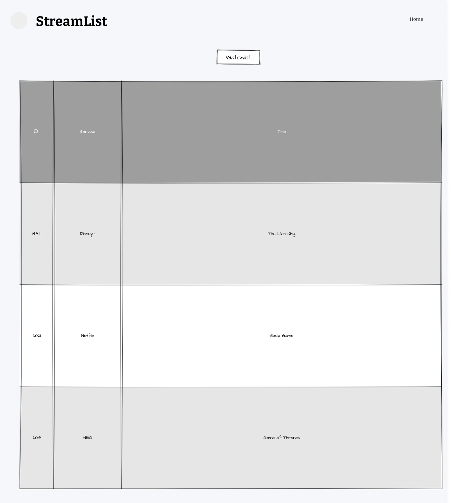

# Stocklist*

*subject to change

## Overview

Interesting in purchasing stocks, but can't keep track of what to buy? Stocklist is a web app allowing multiple users to search the entire NYSE/NASDAQ/AMEX for stocks and add them to your watchlist. For each stock, It reveals informaiton about the company, such as market cap, general description, price to earnings ratio. (maybe graph/charting)

It records what the price was when you added the stock, and tells you how much it went up/down from when you added it to the current time. This tests your stockpicking skills and tells you if you make the right decision or not overtime. 


## Data Model

The application will store lists, stocks with it's respective content

* users can have multiple watchlists (via references)
* each watchlist can have multiple stocks containing information about the company (by embedding)

An Example User:

```javascript
{
  username: "shannonshopper",
  hash: // a password hash,
  lists: // an array of references to List documents
}
```

An Example List with Embedded Items:

```javascript
{
  user: // a reference to a User object
  name: "High risk stocks",
  items: [
    { ticker: "CAKE", company: "The Cheesecake Factory", price_when_added: "24.20", price_now: "11.12", description: "The Cheesecake Factory Incorporated is an American restaurant company and distributor of cheesecakes based in the United States"},
  ],
  createdAt: // timestamp
}
```


## [Link to Commented First Draft Schema](db.js) 

```javascript
const User = new mongoose.Schema({
  	// store user information
    username: String,
    password: String,
  	// watchlist will contain a list of seperate lists of stocks
    watchlists: [Watchlist]
});

const Watchlist = new mongoose.Schema({
  	// name of the watch list as well as an array of all the stocks being stored by the user in that watchlist
    name: String,
    stocks: [Stock]
});

const Stock = new mongoose.Schema({
  	// all relevant information about the company
    ticker: String,
  	name: String,
    priceAdded: Number,
  	// PriceNow would have to be computed in realtime each time user accesses it
    priceNow: Number,
    change: Number,
    description: String
});
```

## Wireframes

(___TODO__: wireframes for all of the pages on your site; they can be as simple as photos of drawings or you can use a tool like Balsamiq, Omnigraffle, etc._)

/list/create - page for creating a new shopping list


/list - page for showing all shopping lists



/list/slug - page for showing specific shopping list


## Site map

(___TODO__: draw out a site map that shows how pages are related to each other_)

Here's a [complex example from wikipedia](https://upload.wikimedia.org/wikipedia/commons/2/20/Sitemap_google.jpg), but you can create one without the screenshots, drop shadows, etc. ... just names of pages and where they flow to.

## User Stories or Use Cases

(___TODO__: write out how your application will be used through [user stories](http://en.wikipedia.org/wiki/User_story#Format) and / or [use cases](https://www.mongodb.com/download-center?jmp=docs&_ga=1.47552679.1838903181.1489282706#previous)_)

1. as non-registered user, I can register a new account with the site
2. as a user, I can log in to the site
3. as a user, I can create a new grocery list
4. as a user, I can view all of the grocery lists I've created in a single list
5. as a user, I can add items to an existing grocery list
6. as a user, I can cross off items in an existing grocery list

## Research Topics

(___TODO__: the research topics that you're planning on working on along with their point values... and the total points of research topics listed_)

* (5 points) Integrate user authentication
    * I'm going to be using passport for user authentication
    * And account has been made for testing; I'll email you the password
    * see <code>cs.nyu.edu/~jversoza/ait-final/register</code> for register page
    * see <code>cs.nyu.edu/~jversoza/ait-final/login</code> for login page
* (4 points) Perform client side form validation using a JavaScript library
    * see <code>cs.nyu.edu/~jversoza/ait-final/my-form</code>
    * if you put in a number that's greater than 5, an error message will appear in the dom
* (5 points) vue.js
    * used vue.js as the frontend framework; it's a challenging library to learn, so I've assigned it 5 points

10 points total out of 8 required points (___TODO__: addtional points will __not__ count for extra credit_)


## [Link to Initial Main Project File](app.js) 

(___TODO__: create a skeleton Express application with a package.json, app.js, views folder, etc. ... and link to your initial app.js_)

## Annotations / References Used

(___TODO__: list any tutorials/references/etc. that you've based your code off of_)

1. [passport.js authentication docs](http://passportjs.org/docs) - (add link to source code that was based on this)
2. [tutorial on vue.js](https://vuejs.org/v2/guide/) - (add link to source code that was based on this)

