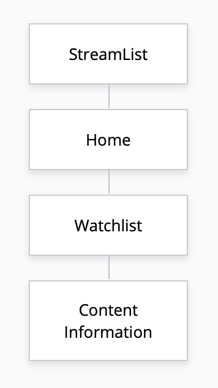

**StreamList**

## Overview

Sometimes, you want to watch a film/tv show, but because of the many streaming services nowadays, it can get confusing on where exactly you can watch it. This web app will allow the user to easily find out where each of the shows they want to watch belongs to what most popular streaming services (Netflix, Disney+, Hulu, TBD). They can make multiple watchlists, and within those watchlists can contain content from different streaming services, allowing the user to keep track of what they want to watch instead of slowly going through each streaming service app to look for what they've wanted to watch.


## Data Model

The application will store users secured with Passport JS middleware, with each user able to hold multiple watchlists, and with each watchlist containing information like streaming service it's available on (can be multiple), title, date released, and description.

* users can have multiple watchlists (via references)
* each watchlist can have multiple films/tvs with containing information about the movie

An Example User:

```javascript
{
  username: "shannonshopper",
  hash: // a password hash,
  watchlists: // an array of references to List documents
}
```

An Example List with Embedded Items:

```javascript
{
  user: // a reference to a User object
  name: "Nostalgic Movies",
  movies: [{
    { title: "The Lion King", type: "Movie", services: "Disney Plus", year_released: 1994, description: "Simba idolizes his father, King Mufasa, and takes to heart his own royal destiny. But not everyone in the kingdom celebrates the new cub's arrival. Scar, Mufasa's brother—and former heir to the throne—has plans of his own."},
  ],
  createdAt: // timestamp
}
```


## [Link to Commented First Draft Schema](db.js) 

```javascript
const Movie = new mongoose.Schema({
  	// the id of the watchlist of where exactly the movie belongs to
  // helpful for finding all the movies from a specific watchlist
    wl_id: String,
  // id used to retrieve description of movie and other details from API
    id: Number,
  // title of the Content
    title: String,
  // whether its a show or movie
    type: String,
  // where the content is available it, can be 1 or multiple 
    services: [String],
  // year of original release
    release: Number,
  // short description of the content
    description: String,
  // pending on if this will be implemented, mark whether its watched or not
    watched: Boolean
});

const Watchlist = new mongoose.Schema({
  // the username of where the watchlist belongs too
  // helpful for retrieving all watchlists from one users
    user : String,
  // what the watchlist is named
    name: String,
  // all the movies within the watchlist, will be an array of documents
    movies: [Movie]
    },
    {
        timestamps: true
    });

const User = new mongoose.Schema({
    username: String,
  // this will be altered when passport registers user, will be salted and hashed
    password: String,
  // array of documents containing watchlists from that specific user
    watchlists: [Watchlist],
});
// passport js will be implemented into user schema for secure user authentication
User.plugin(passportLocalMongoose);
```

## Wireframes

/- home page showing all watchlists for the user as well as the ability to create a new watchlist (I want to see if i could maybe parse an image from one of the titles or multiple titles within the watchlist to display on the watchlist instead of the generic images shown below)


/list - page for showing all content in watchlist, maybe another page showing more information about the tv/movie's if selected on


## Site map



## User Stories or Use Cases

(___TODO__: write out how your application will be used through [user stories](http://en.wikipedia.org/wiki/User_story#Format) and / or [use cases](https://www.mongodb.com/download-center?jmp=docs&_ga=1.47552679.1838903181.1489282706#previous)_)

1. as non-registered user, I can register a new account with the site

2. as non-registered user, I can search for any content I'd like to see and which service it's on

3. as a user, I can log in to the site

4. as a user, I can create a watchlist

5. as a user, I can view all of the content I've added in a single list

6. as a user, I can add content to an existing watchlist

7. as a user, I can remove content off a watchlist

8. as a user, I can remove a watchlist

   

## Research Topics

* (3 points) express-react-views
    * https://github.com/reactjs/express-react-views
    * I initially chose React as one of my research topics, but I already built a large portion of my project in hbs and handlebars by the time I got to researching and learning react, but I still wanted to get familiar with it and incorporate it without redoing my entire project from server side to client side.
    *  Express-react-views provides a nice middle ground as I get to grasp some aspects and syntax on how React components interact on the frontend,props, and how data is expressed vs. traditional handlebars while not having to completely change my backend. You can also add other functions within the .jsx files to modify parts of the frontend while it was not possible with hbs.
    * The downside is express-react-views only works for statically rendered components so it can't mount on the client-side and it doesn't behave as a traditional react app
    
* (2 points) Bootstrap CSS (2pts):
    * To achieve a more modern looking website, bootstrap icons were also used in certain places to improve aesthetics.
* (3 points) Middleware used for secure authentication

    * Passport JS, Passport Mongoose, Connect-Ensure-Login
        * Will use passport local strategy to implement user registration/login.
        * passport local mongoose will be used to implement register directly within the User schema, as well as salting and hashing the password
        * Will authenticate requests anytime a user goes to any page on the server, prevent any data manipulation/retrieval in places where it's not allowed, and will verify the user is logged in via connect-ensure-login
* (1 points) Dynamic routing and url building:

    * use express dynamic routing for developing more coherent and clear URLs for both the user and developer. Useful here since queries, watchlist names, movies, can vary between user to user.
* (3 points) API to retrieve content data and then parse:
    * https://github.com/lufinkey/node-justwatch-api
    * Commercial API but can be used for educational purposes
    * When user searches for content within their watchlist, an async call to the api is made and searches up for that query. The data is returned in a json and very dense so it will be parsed and clean by my own function, scan for where each content is on which service, and then returns an array of objects containing all the movies in a readable manner, which will be added to the db if the user decides too.
    * The user is able to add any of the content that is displayed using the Add hyperlink
    * Api call to get description of the content will be made if user adds the content. 


12 points total out of 8 required points


## [Link to Initial Main Project File](app.js) 

## Annotations / References Used

https://github.com/reactjs/express-react-views

https://github.com/jaredhanson/passport

https://github.com/jaredhanson/passport-local

https://github.com/saintedlama/passport-local-mongoose

https://github.com/jaredhanson/connect-ensure-login

https://github.com/lufinkey/node-justwatch-api

https://www.mongodb.com/developer/how-to/use-atlas-on-heroku/

https://dev.to/reiallenramos/create-an-express-api-static-and-dynamic-routes-33lb
